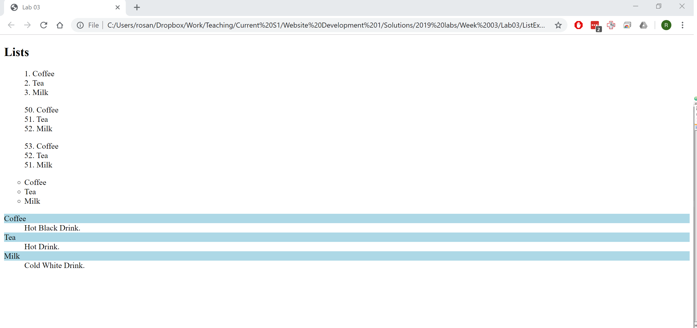

# Adding lists: Exercises

## Exercise One

- Create a folder called 'Lab03' in your WebsiteDevelopment1/Week03 folder.
- Open a text editor and create a new web page called ListExercise.html. You can use the HTML code below to create the basic structure of the page.
- Save the page into the Lab03 folder.

~~~
<!DOCTYPE html>
<html lang="en">
<head>
  <meta charset="UTF-8">
  <title>Lab 03</title>
  
</head>
<body>

</body>
</html>
~~~

- Include the required tags to create the following lists:

- Remember to use `<ul>` for unordered lists, `<ol>` for ordered lists, and `<dl>` for description lists. Each list item in an unordered or ordered list is marked up with a `<li>` tag.

## Exercise Two

Apply the following CSS styles to the lists. Add the code in the `<style>` element in the `<head>` section.

- Set the list-style-position property to *inside* for ordered lists.
- Change the bullet type on the unordered list to *circle*.
- Apply a *lightblue* background colour on the `<dt>` element.

It should look as follows:

