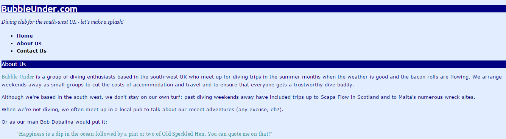

# CSS Recap Exercise

1. For this Exercise you need to download [Lab04](archives/Lab_04.zip).
2. In the Lab04 folder, create a sub folder called css.
3. Open your text editor and create a blank document. Save the file as *style.css* in the css sub folder.
4. In the Lab04 folder open **index.html** and add a link tag in the <head> section that links the .css file.
4. Open **about.html** and **contact.html** and add a link tag in the <head> section that links the .css file.
5. Add the following rules to the .css file:

    1. body: background colour: #e2edff; colour: #000080; font family:  Verdana Helvetica, Arial or sans-serif; line height: increase by 25%.
    2. group selector p and blockquote: small font size; colour:navy.
    3. li: small font size.
    4. h1: extra large font size.
    5. h2: medium font size; normal font weight.
    6. group selector h1, h2 and h3: font family: Trebuchet MS, Helvetica, Arial or sans-serif; background colour: navy; colour: white.
    7. a: bold font weight.
    8. a:link: colour: black; no text decoration.
    9. a:visited: colour: navy; no text decoration.
    10. a:hover: text decoration: underline; colour: white; background colour: navy.
    11. a:active: background colour: navy and colour: aqua.
    12. descendant selector *p a:link*: underline text decoration.
    13. id *tagline*: italic font style; font family: Georgia, Times or serif.
    14. class *fun*: colour: #339999; font family: Georgia, Times or serif; letter spacing: .05em.
   
6. In each of the .html files, apply the *tagline* id to the first paragraph (it is after the H1 heading).
7. In **about.html**, apply the *fun* class to the blockquote.
8. Also, in this file (about.html), apply the *fun* class to the first 2 words  (Bubble Under) of the paragraph after the H2 heading (hint: you can use a `` tag to do this).

