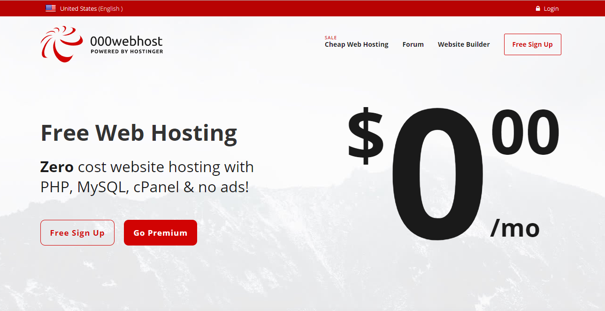
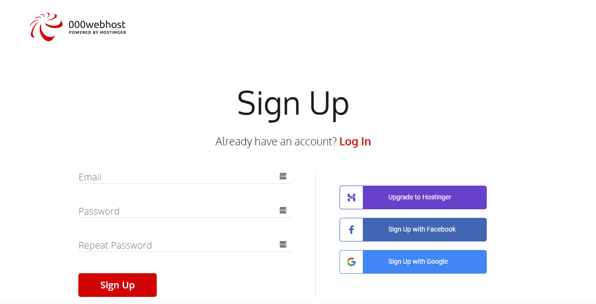
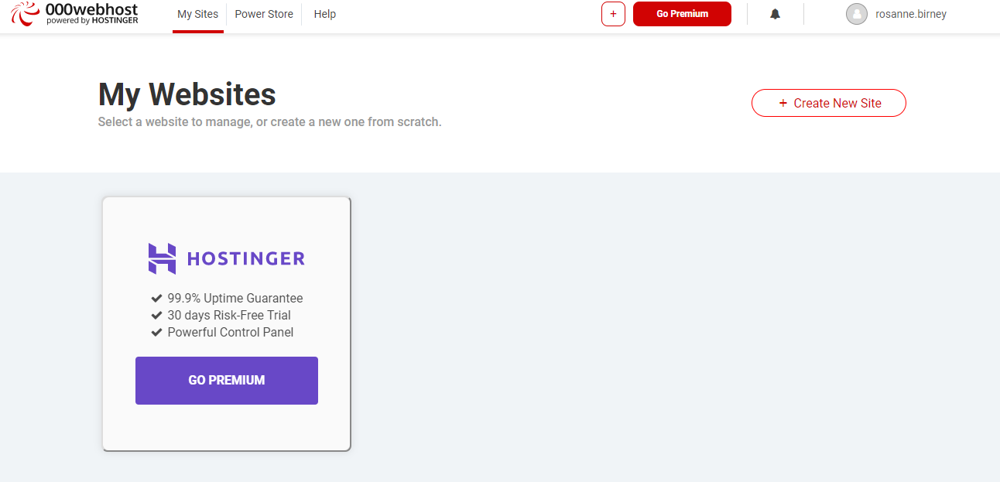
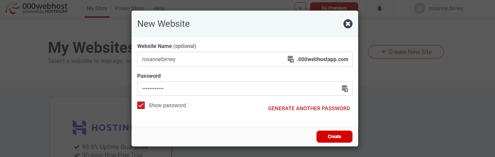
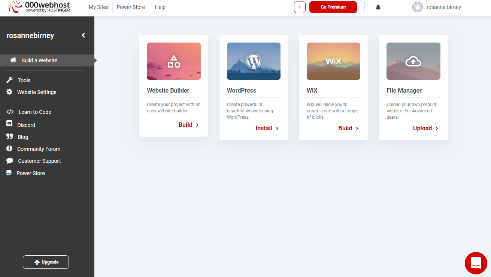

#Create an account with 000webhost

Go to <a href="http://www.000webhost.com" target="_ blank">`http://www.000webhost.com`</a> and select the Free Hosting option. Click on Free Sign Up.

Next, add your email and a password of your choosing.

When asked, select the "It's ok, I want to learn" option.

Next, you will need to verify your email address. Check the email address that you provided and click the link to verify that you have signed up for 000webhost's services.

Once you have logged in successfully, you will see your "My Websites" dashboard.

Click on "Create New Website". In the dialog box that appears, choose a name for your website. This will be the URL of your website. You will also need to re-enter your password.

This will create your website and bring you into the settings for your website, which looks as follows:

We will start to add files in the next step. 
