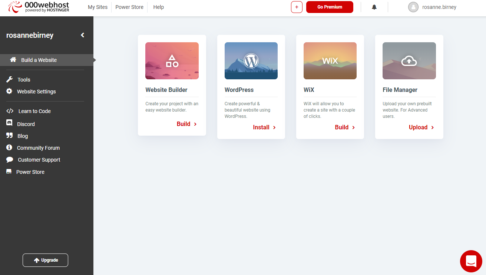

# File Manager

To add some files to your website, click on the "File Manager" option:

Once you open the 000webhost file manager, you will see there is a folder already created called public_html. All of our files need to be placed within this folder.

We will upload a single file first - the index.html page that can be found in the Lab01 folder.

Click the cloud icon (fourth icon in the graphic below) to add upload the file.

Now, see the uploaded file.

Now, click the plus icon (second icon) to add a new folder. Name the folder *exercise1*.

Now, see the created folder.

Double-click to get inside the exercise1 folder. In the next step, we will add files to this folder.
