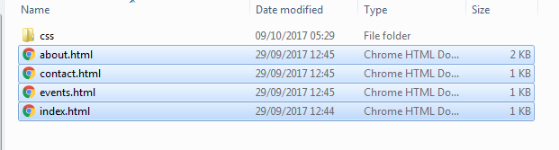
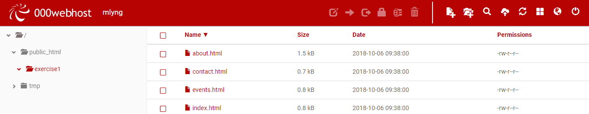
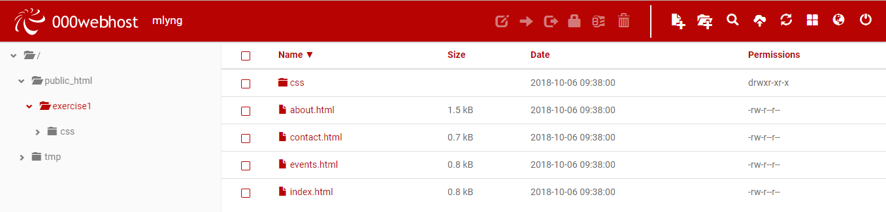
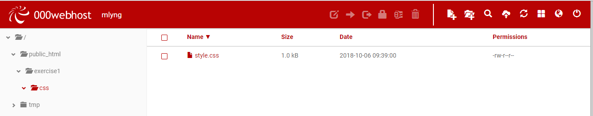

# Upload files

## Adding files in 000webhost

Within the exercise1 folder in the 000webhost File Manager, click the cloud icon (fourth icon) to add/upload the exercise files.

Locate the exercise folder. Select the HTML pages for upload; you can use Shift+Click to select all four in one go.

See the uploaded files in the folder.

Next, create a folder (plus icon on the top right) called *css* within the exercise1 folder.

Upload the *style.css* file into the css folder.

Your file and folder structure on 000webhost should mirror the structure of the files and folders on your own computer; it's very important that they match exactly. At the end of this process, your *exercise1* folder should have these contents:

In the next step, we'll view our website.
