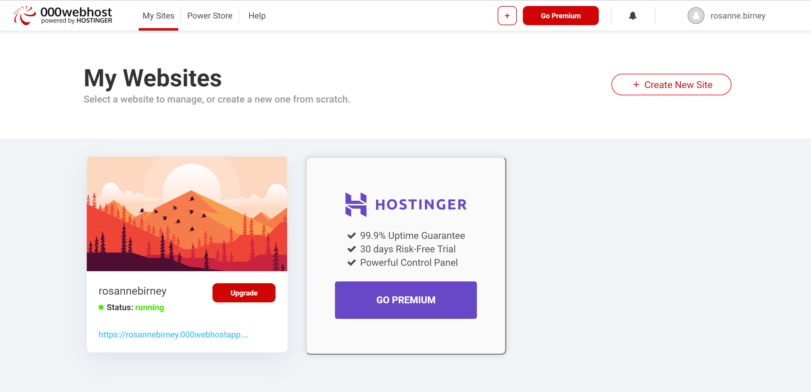
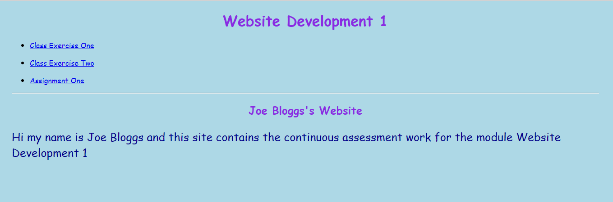
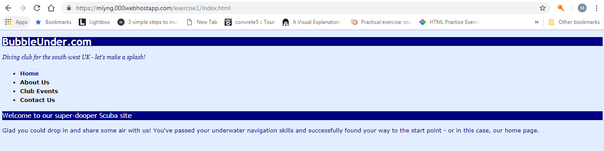

#View your website

Once you are finished uploading files, you can leave the File Manager area (just close the tab/window) and go back to the 000webhost "My Websites" dashboard.

You will see your website has a link under the name and status e.g. `https://rosannebirney.000webhostapp.com`. Click on this link to view your website.

Now you will see our Welcome page.

Click on the link *Class Exercise One*

You should now see your test website, which looks as follows:

Notice the URL.

Congratulations! You just deployed your first website. Now try the exercises in the next step, where you will add some extra content.
