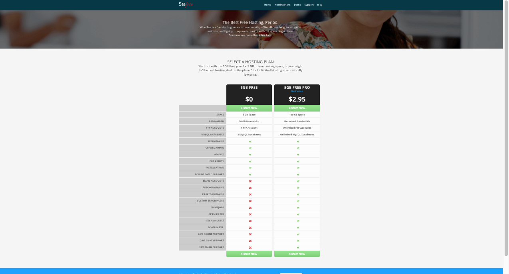
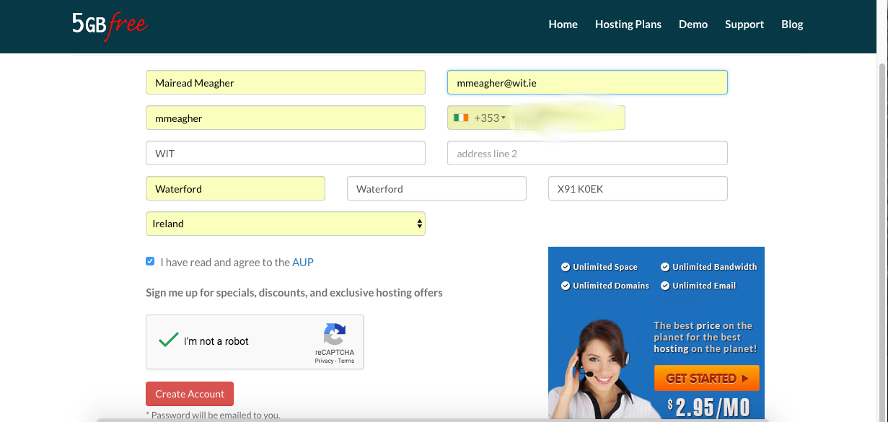
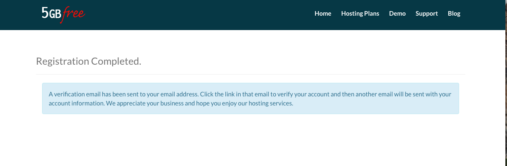
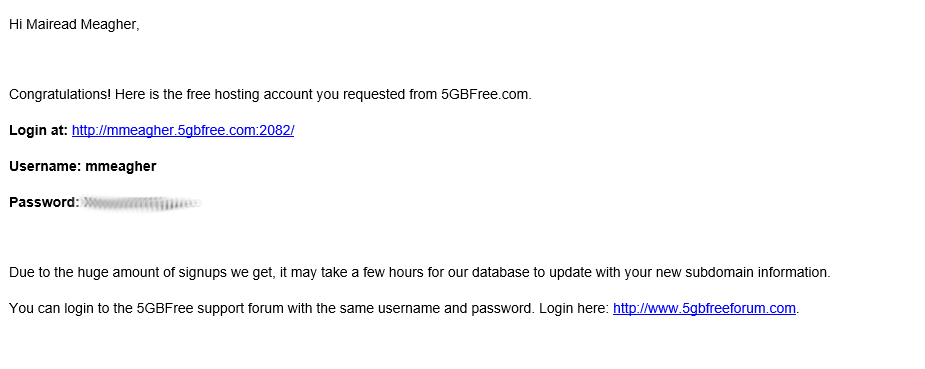
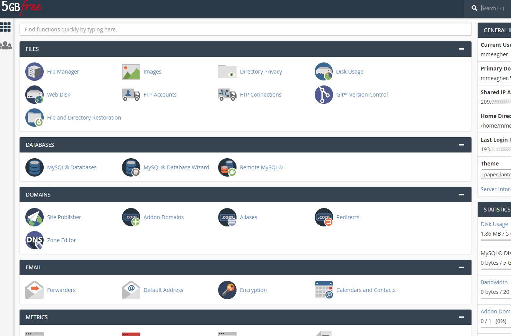

#Create an account with 000webhost

Go to <a href="https://www.5gbfree.com/" target="_ blank">`https://www.5gbfree.com/`</a> and select the Free Hosting option. Click on GET STARTED.

Next, choose the 'Signup Now' under the '5GB FREE' option

You will then be asked to fill in your details.

You will then be logged in and you will need to verify your email address.

Check the email address that you provided (also check your junk folder) and click the link to verify that you have signed up for 5GBfree's services.

Once you have completed this step, you can login to the CPanel using your username and password (as per email). This looks like

