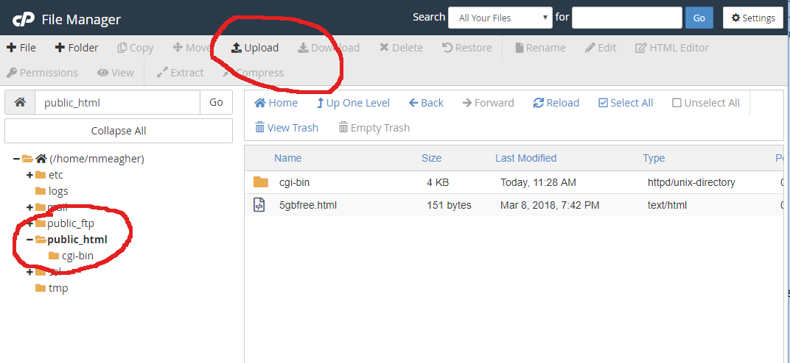
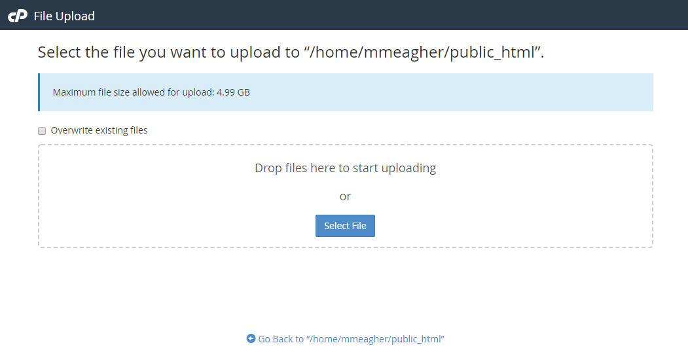
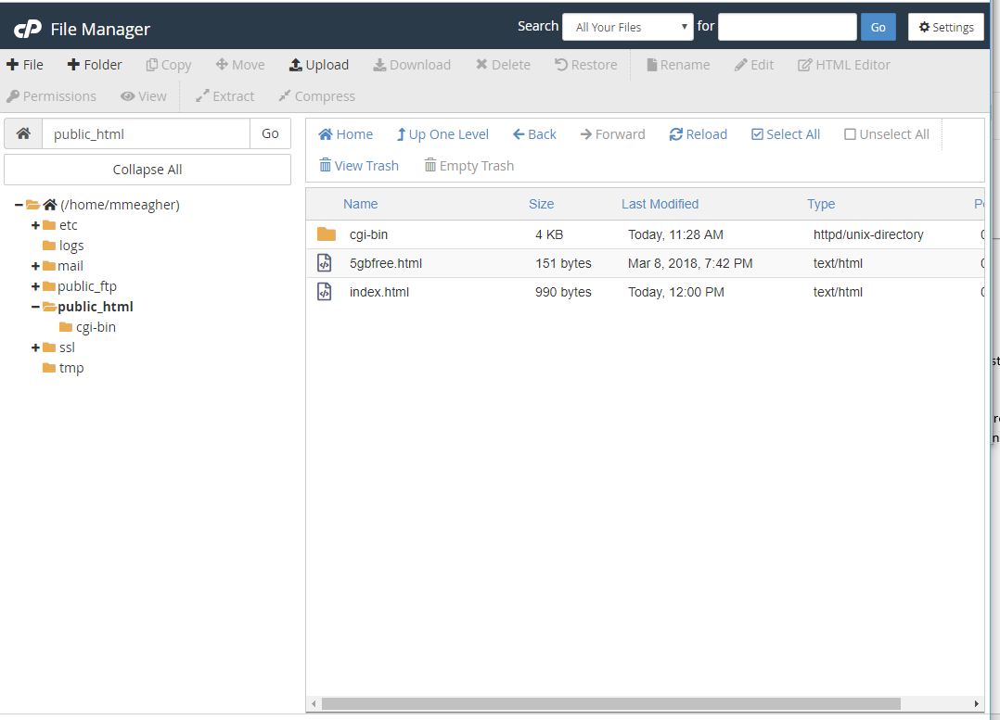
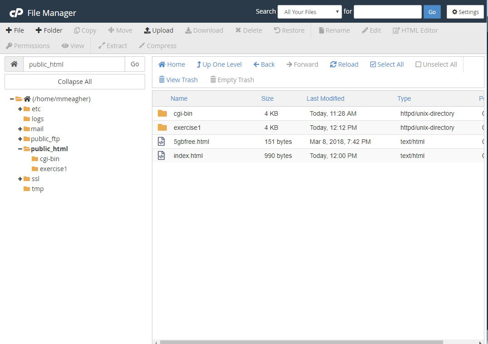

#File Manager

Once you open the 5GBfree CPanel ->  File Manager, you will see there is a set of folders already created, including one called public_html. All of our files need to be placed within this folder. 

We will upload a file first (index.html). This file can be found in Lab01.

Click the upload button on the top menu. This will give you: 

Now, see the uploaded file.

Now, click the plus icon (second icon) to add a new folder. Name the folder *exercise1*

Now, see the created folder.

Double-click to get inside the exercise1 folder. In the next step, we will add files to this folder....