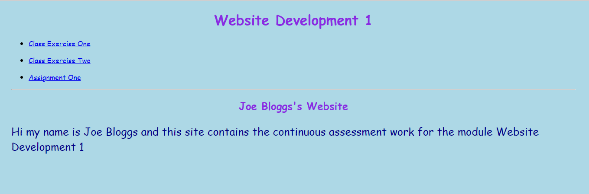

#View your website

Once you are finished uploading files, you can leave the File Manager area (just close the tab/window) and go back to the 5GBfree CPanel. 

You will see a link to your website on this screen e.g. mmeagher.5gbfree.com . 

This is a link so click it to view your website.

Now you will see our Welcome page.

Click on the link *Class Exercise One* 

You should now see your test website, which looks as follows:

Notice the URL.

Congratulations! You just deployed your first website. Now try the exercises in the next step, where you will add some extra content.