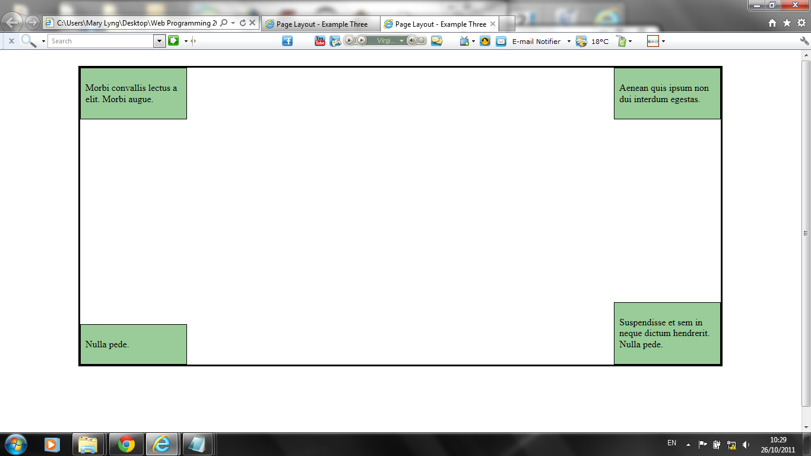
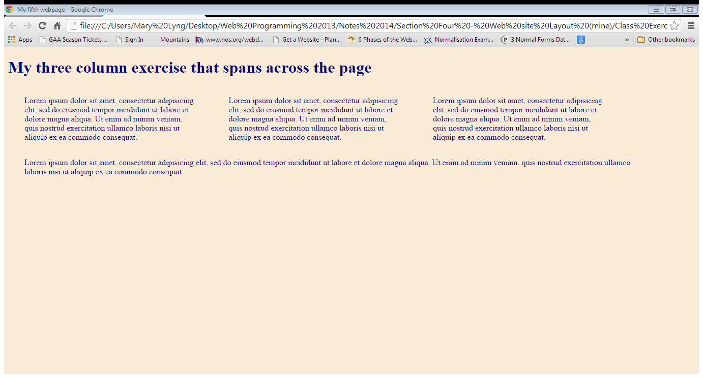

# Exercises

## Exercise One: Using Absolute Positioning

- Download and unzip [lab02.zip](archives/lab02.zip).
- Your objective for this HTML & CSS exercise is to add code to the .css file (teststyle.css) to position the 4 divisions (positiona, positionb, positionc, and positiond) as in the screenshot below.
- You will need to use position:absolute for each division style and specify values for left or right; and top or  bottom.

## Exercise Two: Using Float
<ul>
<li> Download and unzip [lab03.zip](archives/lab03.zip).</li>
<li> Your objective for this HTML & CSS exercise is to add code to the .css file (floatexercise.css) to position the first three paragraphs side by side using the float properly. The next (fourth) paragraph is to be positioned underneath the previous three, as shown below.</li>
<li> Note: The floated paragraphs will also require the following properties:
 <ul>
 <li> width:25%;</li>
 <li> margin:1% 3%;</li>
</ul></li>
</ul>

