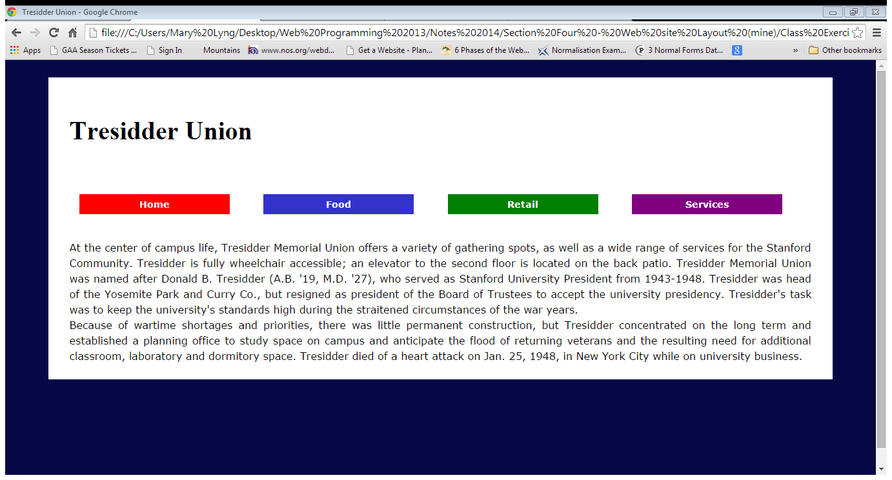

## Exercise: Tresidder Union

In this exercise you are to create a different layout for the Tresidder Union website. You should add structural elements to the HTML file and then add styles to the CSS file, so that the website looks as follows:

Download [lab05.rar](archives/lab05.rar) and extract it into your Week 8 folder. (Again, don't continue with the same website files that you worked on earlier; the aim is to create a different layout for the Tresidder site, starting from scratch.)

The four different colours for the link items are red; #3333CC; green; and purple. (Hint: you can use classes to style each item differently.)
