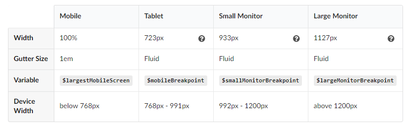

#Semantic UI Containers

Containers provide the foundation for page layout. A container is an element designed to contain page elements to a reasonable maximum width based 
on the size of a user's screen. This is useful to couple with other UI elements like `grid` or `menu` to restrict their width to a reasonable size for display.

Semantic UI requires a containing element to wrap elements and contain its grid system (more on the grid system next). The Semantic UI container class was 
created specifically for this purpose.

##Container Sizes

Containers are designed to responsively adjust their maximum width based on the size of the screen on which they are appearing.

**Note:** There is another computer device (widescreen), which is for device width > 1920px.

## UI Container
An `ui container` is a fixed width element that wraps your site's content. It redivs a constant size and uses margin to center. 
Containers are the simplest way to center page content inside a grid.

~~~

  Example of a fixed width container which is set using the <code>.ui.container</code> class.

~~~

<a href="archives/Class Htmls/eg1.html" target = "_ blank">Example</a>
