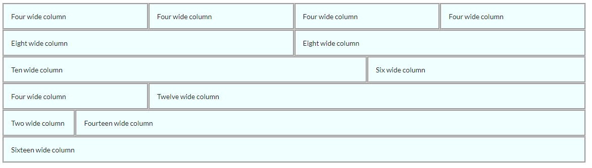

# Semantic UI Grid System
Grid systems enable you to create advanced layouts using rows and columns.

Semantic UI uses a **16 column grid**, where each column is of equal width with spaces in between. These spaces are called `gutters`.
The use of grids is by far the most popular method for dividing and utilizing space. Regardless of which framework you choose to develop with, a 
solid understanding of the grid layout will allow you the most flexibility and control in your designs.

If you would like to divide your content into 4 sections across the page it's as simple as dividing the 16 total columns by 4, which equals 4. 
This means you'll need to specify that each column takes up a width of four in order to have four columns across the page.

~~~

    

      
One

      
Two

      
Three

      
Four

  

~~~

<a href="archives/Class Htmls/eg2.html" target = "_ blank">Example</a>

Here's another example of a Semantic UI grid:

