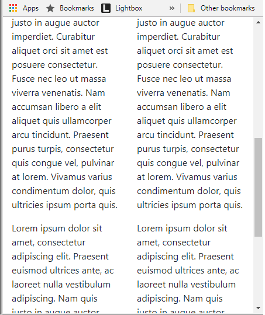

# Semantic UI Grid - Exercise One

- Download, extract and open the [Lab01](archives/lab01.rar) folder in Week09.
- A web page has been created for you, add Semantic UI code that will lay out the web page as follows:

You will notice that when you resize the browser to small viewport size, the 4 columns of text appear
very narrow.

- Adjust the code for the 4 columns such that the columns of text are size 8 on very small viewports (mobile), and size 4 on all other devices.

