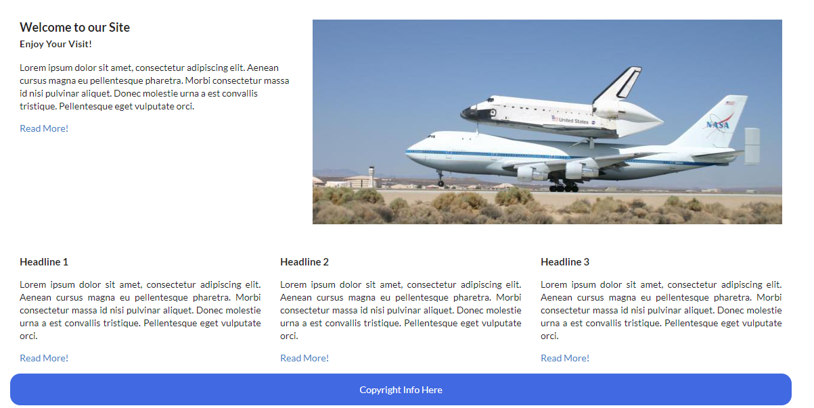
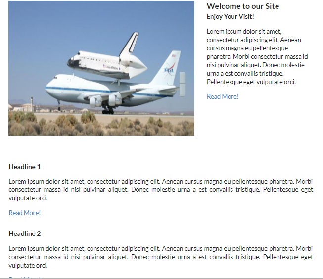

# Semantic UI Grid - Exercise Two

- Download, extract and open the [Lab02](archives/lab02.rar) folder in Week09.
- A web page has been created for you. Add the necessary tags to render index.html as follows:

Now, adjust the necessary tags to render index.html as follows when the screen viewport is at mobile viewport:

