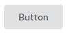

# Buttons

We can add an `ui button` class to an &lt;button&gt; tag. This gives you a standard button like follows:

~~~
<button class="ui button">
   Button
</button>
~~~

.

You can specify a less prounouced button by adding the `basic` class as follows:

~~~
<button class="ui basic button">
   Basic
</button>
~~~

.

Again, you can specify the size for the button by added the particular *size* class, choices are:

 - mini
 - tiny
 - small
 - medium
 - large
 - big
 - huge
 - massive
 

You can specify the type of button, choices are:
 
 - primary
 - secondary
 - positive
 - negative
 

And, you can specify a colour for the button by adding a *colour* class.
 
 ~~~

 <section class="ui segment">
  <button class="ui button">
   Button
  </button>
  <button class="ui basic button">
   Basic
  </button>
  <button class="ui primary button">
   Primary
  </button>
  <button class="ui secondary button">
   Secondary
  </button>
  <button class="ui positive button">
   Positive
  </button>
  <button class="ui negative button">
   Negative
  </button>
  <button class="ui teal button">
   Teal
  </button>
  <button class="ui orange button">
   Orange
  </button>
  <button class="ui purple button">
   Purple
  </button>
 </section>

 <section class="ui segment">
  <button class="ui mini button">
   Mini
  </button>
  <button class="ui tiny button">
   Tiny
  </button>
  <button class="ui small button">
   Small
  </button>
  <button class="ui medium button">
   Medium
  </button>
  <button class="ui large button">
   Large
  </button>
  <button class="ui big button">
   Big
  </button>
  <button class="ui huge button">
   Huge
  </button>
  <button class="ui massive button">
   Massive
  </button>
 </section>

~~~

<a href="archives/Class Htmls/example7.html" target="_blank">Example</a>

## Inverted

A button can be formatted to appear on dark backgrounds.

~~~

 <section class="ui inverted segment">
  <button class="ui inverted button">Standard</button>
  <button class="ui inverted primary button">Primary</button>
  <button class="ui inverted secondary button">Secondary</button>
  <button class="ui inverted teal button">Teal</button>
  <button class="ui inverted orange button">Orange</button>
  <button class="ui inverted purple button">Purple</button>
 </section>

 <section class="ui inverted segment">
  <button class="ui button">Standard</button>
  <button class="ui primary button">Primary</button>
  <button class="ui secondary button">Secondary</button>
  <button class="ui teal button">Teal</button>
  <button class="ui orange button">Orange</button>
  <button class="ui purple button">Purple</button>
 </section>

~~~

<a href="archives/Class Htmls/example8.html" target="_blank">Example</a>
 

More information about images may be found at <a href ="https://semantic-ui.com/elements/button.html" target = "_blank">Semantic UI Button</a>.

