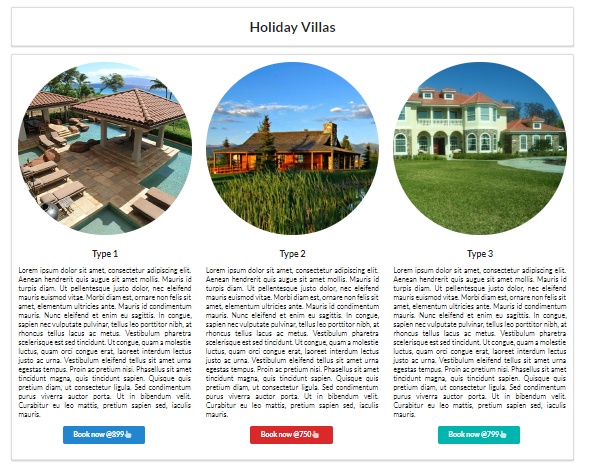

# Semantic UI Elements - Exercise

- Download, extract and open the [Lab03](archives/lab03.rar) folder in Week09.
- A web page has been created for you, add 3 images from the images folder (feat1.jpg, feat2.jpg, and feat3.jpg), which are responsive and displayed as a circle.
- Add Semantic UI code that will display the output as follows on all viewports except on mobile devices, where it will be stackable:

- The `header` and `section` are enclosed in segments, which are center aligned.
- Add 3 buttons as shown with the `hand pointer icon` included.
