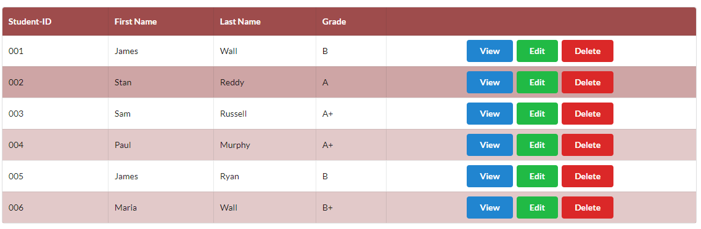

# Semantic UI Table Exercise

- Download, extract and open the [Lab01](archives/Lab01.rar)  folder in Week10.</li>
- A web page with a table has been created for you, add Semantic UI table classes that will:
    - Stripe the table.
    - Add a hover.
    - Add a border to all the cells.
    - Condense the table.
- Add CSS style rules to the `css` file (`mycss.css`) that will:
    - Add a top margin to the container.</li>
    - Modify the style for **.ui.table thead th** so that the background colour is rgb(158, 76, 76), and the colour is white.
    - Modify the style for **.ui.striped.table > tr:nth-child(2n),.ui.striped.table tbody tr:nth-child(2n)** so that the background colour is the same as the &lt;th&gt; 
   above but with an  opacity of .3.
    - Modify the style for **.ui.selectable.table tbody tr:hover,.ui.table tbody tr td.selectable:hover** so that the background colour is the same as the &lt;th&gt; 
   above but with an opacity of .5.
- Add 3 buttons with the classes as in the image below for each row with the respective labels: View, Edit, Delete.

