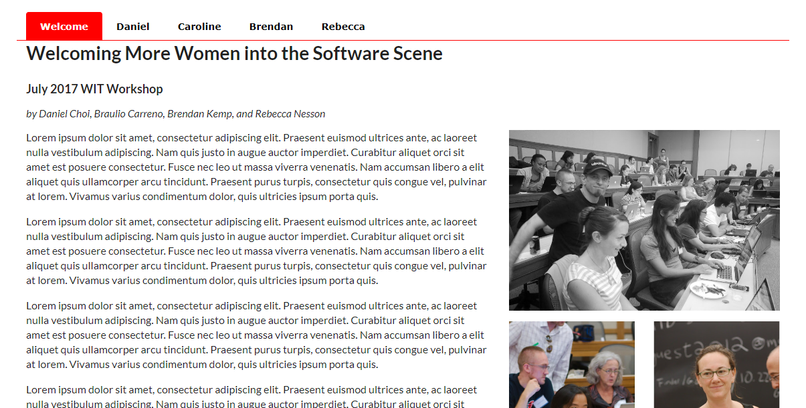

# Tabular Menu Exercise

- Download, extract and open the [Lab02](archives/lab02.rar) folder in Week10.
- A web page has been created (and styled) for you, add Semantic UI table classes that will:
    - Create a tabular menu at the top of the page as in the screenshot below.
- Add CSS style rules that will:
    - Copy the style for `.ui.tabular.menu` and change the border bottom colour property to red.
    - Copy the style for `.ui.tabular.menu .item`  and modify some properties so that the font family is some sans-serif font, and the menu item is black and bolded.
    - Copy the style for `.ui.tabular.menu .item:hover` and modify some properties so that the background colour is pink and the colour is white.
    - Add a border radius (as in the `.ui.tabular.menu .active.item`). Finally, add a border colour of pink.
    - Copy the style for `.ui.tabular.menu .active.item` and modify some properties so that the background colour is red and the colour is white. Finally, add a border colour of red.

