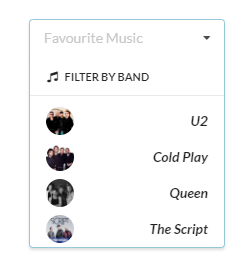

# Dropdown Menu Exercise

- Download, extract and open the [Lab03](archives/lab03.rar) folder in Week10.
- A web page has been created for you, add Semantic UI table classes that will:
    - Create a dropdown menu as in the screenshot below.
- Add CSS style rules that will:
    - Remove the border between menu items.
    - Create a style rule for &lt;span&gt; and add font weight and font style properties and floating to the right.
    - Apply the &lt;span&gt; tags around the band names.

