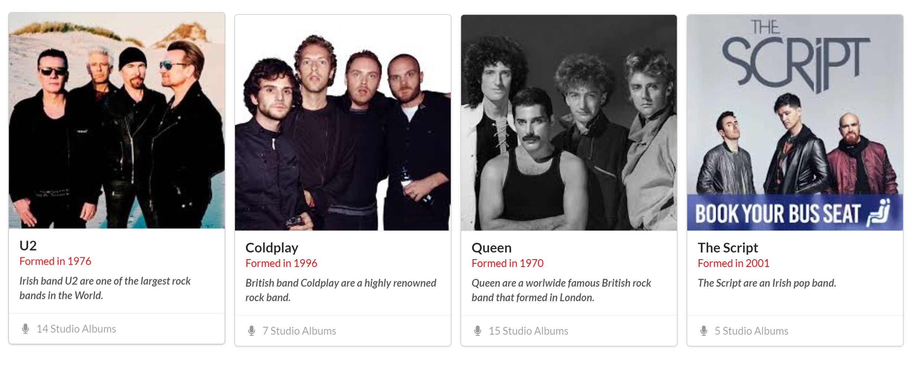

## Card Exercise

- Download, extract and open the [Lab04](archives/Lab04.rar) folder in Week10.
- Add code to the web page that will create and style four cards inside the `ui.link.cards` class as in the screenshot below.

