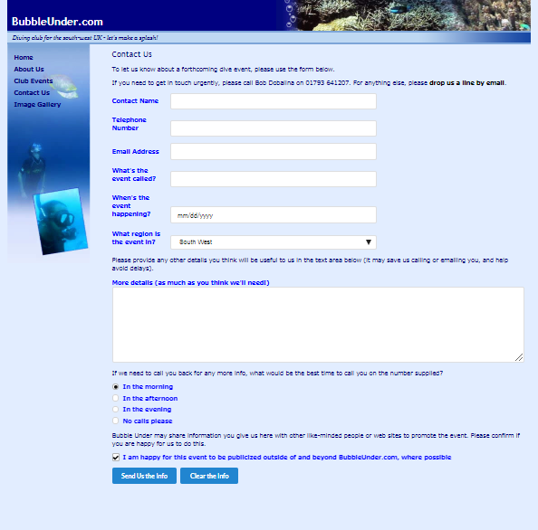

# Part One

- Download, extract and open the [lab01](archives/lab01.rar) folder in Week11.
- A web page (**contact.html**) with a form (and one form element) has been created for you, add the remaining HTML form elements as in the following image:

**Note**: As you can see:

- The next four elements are text boxes.
- The **select** element has the following options:
    - South West.
    - South East.
    - Midlands.
    - Central.
    - London.
    - East.
    - North.
    - Scotland.
    - Northern Ireland.
    - Overseas.
- The next element is a textarea element.
- Then there is a series of radio button options.
- Followed by a checkbox.
- Finally a Submit and Reset button.

As you add the elements and their respective labels, add Semantic UI classes for layout.
